<div align="center">


# Skein

**A desktop workspace for Git repository sets, local comparison, and reviewed changes.**



</div>

Skein organizes related Git repositories into reusable sets. Clone a workspace,
inspect local changes, compare folders or Git snapshots, copy selected differences,
and stage and commit your work from one desktop app.

Use the same repository in several folders when you need separate checkouts.
Skein remembers each folder and reference, so tomorrow starts with a workspace,
not another round of "which terminal was that?"

Skein was previously named PaperWing, and before that Flock. When the new settings file is absent, the app
attempts to copy settings from `%APPDATA%\dev.flock.app\`. Token lookup also supports
the old Credential Manager service `flock`. The published v0.1.0 installers retain
their original Flock branding; new builds use Skein.

---

## Contents

- [What Skein does](#what-skein-does)
- [The workspace model](#the-workspace-model)
- [A typical workflow](#a-typical-workflow)
- [Comparing folders and references](#comparing-folders-and-references)
- [Branches, commits, and push](#branches-commits-and-push)
- [Recovery and limits](#recovery-and-limits)
- [How it works](#how-it-works)
- [Install](#install)
- [Setup](#setup)
- [Keyboard shortcuts](#keyboard-shortcuts)
- [Build from source](#build-from-source)
- [Where things are stored](#where-things-are-stored)

## What Skein does

Skein is a Windows-first desktop app for work that spans several Git repositories.
Use named sets for a product, customer workspace, release, or experiment.
Each row remembers its repository URL, folder name, and checkout reference.

The main capabilities are:

| Capability | What you get |
|---|---|
| Repository discovery | GitHub, GitHub Enterprise, and manual Git URLs; organization browsing, search, favorites, and paging. |
| Repeatable workspaces | Named sets, duplicate checkouts, shared reference selection, custom destination paths, and parallel cloning. |
| Local Git visibility | Current branch or commit, ahead/behind counts, changed-file counts, and a tree of branches, tags, remotes, stashes, and submodules. |
| Folder comparison | Local working trees or read-only Git snapshots, file filters, content-based differences, and commit-history comparisons where available. |
| File comparison | Monaco side-by-side or inline diffs, difference navigation, editable working-tree files, and directional block copying. |
| Reviewed changes | New branches, staged/unstaged file previews, commit messages, and a separate Push action. |
| Recoverable copies | Confirmed file/folder copy previews, per-file outcomes, saved-operation undo, and persisted recovery records. |
| Desktop workflow | Tabs, a command palette, Git Activity, resizable panels, light/dark/system themes, bundled fonts, and VS Code integration. |

Search filters repository lists that Skein has loaded. It is not server-wide code search.
The app uses ordinary Git repositories, so terminal commands and other editors still work.
Skein reduces terminal juggling; Git retains its right to complain about conflicts.

## The workspace model

These terms describe the app:

| Term | Meaning |
|---|---|
| Source | A GitHub/GitHub Enterprise connection or a list of manual repository URLs. |
| Set | A saved collection of repository rows. Sets are not Git repositories themselves. |
| Repository row | One intended checkout, including its URL, destination folder, and selected ref. The same URL can appear more than once. |
| Checkout ref | The branch, tag, or commit that Clone/Switch targets. Selecting a ref does not immediately change disk files. |
| Working tree | The actual files in a local repository folder, including uncommitted changes. |
| HEAD | The current local commit. HEAD does not mean the latest remote commit. |
| Staged changes | Content in the Git index, ready for the next commit. Saved files and staged files are different things. |

For example, one set can contain the same repository as `application-main` and
`application-feature`. Each folder has its own checkout and local changes.
The set name is a useful label, not a transaction across every repository.

## A typical workflow

Start with a configured source and destination root:

1. Browse an organization or search loaded repositories. Add repositories to a named set.
2. Choose each row's **Checkout** ref. Use **Ref for selected** for a shared branch or tag.
3. Rename or duplicate rows when you need several checkouts of one repository.
4. Choose a destination layout, review its preview, and select **Clone**.
5. Inspect **Local** status. Compare folders or refs and save the changes that you need.
6. Open **Commit changes**, stage the intended files, review their diffs, and enter a message.
7. Commit locally. Use **Push** separately when you are ready to publish.

**Flat** layout places folders directly under the destination root.
**Custom** layout builds paths from `{folder}`, `{repo}`, `{org}`, `{set}`, `{ref}`, and `{source}`.
For example, `{set}\{org}\{folder}` groups repositories by set and organization.
Review the destination preview before changing a template: paths determine which checkout the app uses.

Most set Git actions use checked rows. **Compare across set** is the exception: it includes every row.
Removing a row or set removes its saved configuration, not its cloned folders.

### Clone and synchronization actions

The actions have distinct effects:

| Action | Effect |
|---|---|
| Clone | Creates the checkout at the chosen ref. The UI supports one to eight parallel jobs and optional shallow history. |
| Fetch | Fetches from `origin`, including tags and pruning stale remote-tracking refs. It does not check out a branch. |
| Switch | Fetches, checks out the selected ref, and attempts a fast-forward for a branch. It is not a purely local checkout. |
| Pull | Fetches and fast-forwards the current branch from its upstream. Diverged history needs manual resolution. |
| Push | Publishes the current local branch; it is separate from Clone, Save, and Commit. |

The existing-folder setting also matters. **Skip** leaves the folder alone.
**Fetch** in this setting means fetch and switch to the selected checkout ref.
**Reclone** retains the existing folder as a sibling `.bak-...` directory before cloning again.
Fetch, Switch, and Pull check that `origin` matches the row's URL.
Git can refuse a checkout that would overwrite local changes.

### Finding your way around

The sidebar contains sets, favorites, sources, and local repository trees.
Tabs keep browsing and comparison contexts separate. The right panel shows destinations,
clone options, or comparison details. Settings contains Sources, Appearance, and Cloning.

Open **Activity** from the status bar to inspect Git commands, timings, exit codes,
and bounded, redacted output. Filter results, cancel a running command, or clear finished entries.
Activity is a diagnostic preview, not a permanent audit log.

## Comparing folders and references

Comparison works with repository folders represented in your sets.
Skein is not currently a general-purpose picker for arbitrary non-Git folders.

The default **Compare repository refs** view compares **HEAD** on the left with
**Working tree** on the right. This shows the current local commit against disk files.
To compare two local checkouts like Beyond Compare, select their repository rows and
choose **Working tree** on both sides.

For example, compare `application-main` on the left with `application-feature` on the right.
Both panes then represent local files. There is no remote folder receiving edits.

Each endpoint supports these reference types:

| Reference | What Skein reads | Writable? |
|---|---|---|
| Working tree | Current local disk files | Yes, where the safe-write policy permits |
| HEAD | Current local commit | No |
| Branch or tag | A Git snapshot resolved in the local repository | No |
| Remote branch | A local remote-tracking reference, such as `origin/main` | No |
| Commit SHA | The snapshot identified by a commit ID | No |

Comparison does not check out either side. Resolving missing references or objects can fetch
from the remote; comparison never uploads changes. Refresh a comparison after external edits.
Failures and unavailable content remain visible rather than counting as identical files.

### Folder and file views

The folder view distinguishes identical, different, left-only, right-only, and conflicting entries.
Use **All**, **Differences**, **Same**, or **Orphans**, filter file paths, and expand directories.
The details panel provides whitespace, line-ending, and exclusion rules.
Ordinary comparisons start with exclusions for `*.orig`, `build/`, and `.vs/`.
Commit-history counts and lists appear when the repositories provide usable history.

Double-click a file to open its Monaco diff. Choose side-by-side or inline view,
hide unchanged regions, and navigate differences. Git snapshots remain read-only.
Supported working-tree panes allow editing and saving, including either side of a local-folder comparison.
Unsaved buffers prompt for Save, Discard, or Keep editing when an operation needs to close them.

### Copy left and copy right

The direction names describe the destination:

- **To left** copies content from right to left.
- **To right** copies content from left to right.

Block-copy controls in the file editor change the destination buffer. Save the buffer to write disk files.
**File to left/right** and folder-view copy actions prepare a whole-file copy preview.
Review which files will be created or overwritten, then select **Confirm copy**.
Only working-tree destinations accept writes; copying into a branch or commit snapshot is disabled.

Copies leave source files in place. Destination-only entries are retained, not deleted.
Folder copying is therefore not a mirror operation. Copying and saving do not stage,
commit, or push anything. Git still expects the paperwork.

### Compare across a set

**Compare across set** applies common left/right refs and comparison options to every row.
Each row compares two references within that row's repository folder.
It does not automatically pair different sets or compare neighboring rows with each other.

Unchecked rows and duplicate folders remain included. The summary reports file differences,
line counts where available, and history counts. Missing clones or refs have separate results.
Binary or unavailable content can make line counts **N/A**.
Whole-set comparisons use all files without exclusions, including after drilldown.
Open a completed row for its folder comparison. Changed set context requires a fresh run.

## Branches, commits, and push

### Create a branch

Open **New branch** for one cloned repository or selected cloned repositories.
Enter a branch name and optional start point. The default is each repository's current commit.
Choose whether to switch to the new branch. A shared start point must exist in every target.
Batch creation reports each repository's result; it does not roll back earlier successes.

For one repository, **Keep it in its own folder** adds a row and clones a separate checkout.
Skein creates and checks out the new branch there, leaving the original folder on its branch.
This is a fresh clone, not a copy of the original uncommitted files.
The branch starts locally; publishing still requires Push.

### Review and commit changes

Open **Commit changes** for one cloned repository:

1. Review the **Changes** and **Staged** file lists.
2. Select a file to inspect its staged or unstaged diff, side by side or inline.
3. Tick files to stage them, or unstage content that does not belong in the commit.
4. Review the staged-file and line-count summary, branch, and author.
5. Enter a commit message and select **Commit**, or press **Ctrl+Enter**.

Commit records the current Git index. The command does not automatically stage other files,
amend a commit, or push. Changes staged from a terminal are part of the same index.
The dialog warns about missing author configuration and detached HEAD.
Create a branch before committing if you need the commit attached to a branch.

Use a message that explains the change. `fix stuff` is technically a message;
it is less useful when future-you becomes the incident investigator.

### Push and delete local branches

Push sends the current branch to its configured upstream without force pushing.
For a branch without an upstream, Skein selects `origin`, or the only configured remote,
and publishes the branch with an upstream. Ambiguous remotes need a terminal selection.
Detached HEAD cannot be pushed through this action. Multi-repository Push asks for confirmation
and reports failures without rolling back successful pushes.

The sidebar branch tree also supports confirmed deletion of non-current local branches.
Unmerged branches require an additional force-delete confirmation. Remote branches remain untouched.
Use Git tools for merge/rebase conflict resolution, advanced history editing, or remote branch deletion.

## Recovery and limits

Editor saves and confirmed filesystem copies use backups and persisted recovery records.
Use **Undo saved operation**, **Undo batch**, or **Open filesystem recovery** as appropriate.
Recovery checks recorded bytes and refuses to overwrite a file changed since the operation.
Cleanup removes eligible recovery records and their backups after confirmation.

A copy batch is a sequence of per-file operations, not one atomic transaction.
Cancellation stops between files; files already copied remain applied.
Inspect partial results before retrying or undoing. Recovery covers filesystem saves/copies,
not Git commits, branch deletion, pushes, or every action performed in a terminal.
Recovery is a seat belt, not a time machine.

Current limits include:

- Editor and copy content: 2 MiB per file. Binary, invalid UTF-8, mixed-line-ending,
   linked, oversized, or otherwise unsupported content does not receive an editable text pane.
- Copy previews: at most 128 files and 32 MiB of combined source/destination content.
- Recovery storage: 512 MiB and 1,024 records. A full store refuses writes rather than evicting backups.
- Commit file lists: at most 2,000 changed files; non-UTF-8 names can be omitted with a warning.
   Git still commits the entire staged index. Review larger changes with Git directly.

Recoverable writes require local Windows NTFS with Transactional NTFS (TxF) available.
Microsoft deprecated TxF. Unsupported volumes, unavailable transactions, and unsupported
path/file metadata fail closed, with no unsafe write fallback.
Network shares and reparse paths are not supported for these writes.

Writes preserve owner, group, ordinary permissions (DACL), basic attributes, and creation time.
The write service does not preserve auditing permissions (SACL), extended attributes,
object IDs, hard-link membership, or short names. Backup checksums detect corruption;
they do not authenticate backups against malicious tampering. Keep independent backups of important work.

This README describes the current source, including features absent from the published v0.1.0 installers.
The development build is not a signed-off release; live acceptance and UX work remain in progress.

## How it works

Skein combines a Svelte/TypeScript interface with a Rust backend through Tauri.
The interface owns sets, tabs, dialogs, and editor buffers. Tauri commands request
repository listings, Git operations, comparison snapshots, and authorized filesystem writes.

Repository discovery uses the GitHub API or GitHub Enterprise API. Manual URLs bypass API listing.
Git operations use your installed `git` and its SSH or HTTPS authentication setup.
The source's API token does not replace your Git credentials.
Monaco supplies the text editor and diff views; Git objects supply read-only snapshot content.
The Windows write service supplies the recovery journal outside your repositories.

The implementation is organized around these areas:

| Area | Main implementation |
|---|---|
| Shell, tabs, settings persistence | [App.svelte](src/App.svelte), [state.svelte.ts](src/lib/state.svelte.ts), [workspace.ts](src/lib/workspace.ts) |
| Browsing, sets, refs, and paths | [RepoList.svelte](src/components/RepoList.svelte), [SetView.svelte](src/components/SetView.svelte), [RefPicker.svelte](src/components/RefPicker.svelte), [RightPanel.svelte](src/components/RightPanel.svelte) |
| Sources, settings, and appearance | [Settings.svelte](src/components/Settings.svelte), [github.rs](src-tauri/src/github.rs), [settings.rs](src-tauri/src/settings.rs), [appearance.ts](src/lib/appearance.ts) |
| Git execution, synchronization, status, and trees | [git.rs](src-tauri/src/git.rs), [clone.rs](src-tauri/src/clone.rs), [local.rs](src-tauri/src/local.rs), [Sidebar.svelte](src/components/Sidebar.svelte) |
| Git commands, activity, and shortcuts | [commands.ts](src/lib/commands.ts), [ActivityDrawer.svelte](src/components/ActivityDrawer.svelte) |
| Folder and whole-set comparison | [compare.rs](src-tauri/src/compare.rs), [compare.svelte.ts](src/lib/compare.svelte.ts), [FolderCompare.svelte](src/components/FolderCompare.svelte), [SetCompare.svelte](src/components/SetCompare.svelte) |
| Text editing and diff rules | [FileCompare.svelte](src/components/FileCompare.svelte), [CompareDetails.svelte](src/components/CompareDetails.svelte), [editor.ts](src/lib/editor.ts), [monaco.ts](src/lib/monaco.ts) |
| Branch creation and staged commits | [BranchDialog.svelte](src/components/BranchDialog.svelte), [CommitDialog.svelte](src/components/CommitDialog.svelte), [commit.rs](src-tauri/src/commit.rs) |
| Copy, recovery, and path safety | [CopyOperations.svelte](src/components/CopyOperations.svelte), [RecoveryPanel.svelte](src/components/RecoveryPanel.svelte), [files.rs](src-tauri/src/files.rs), [file_guard.rs](src-tauri/src/file_guard.rs), [paths.rs](src-tauri/src/paths.rs) |

## Install

This repository contains source code and design plans, not prebuilt downloads.
Build from source for the current Skein development version.

The desktop app needs Windows 10/11, [Git for Windows](https://git-scm.com/download/win),
and the [Microsoft Edge WebView2 runtime](https://developer.microsoft.com/microsoft-edge/webview2/).
Git must be available on `PATH`. New installer builds use the Skein product name.
Unsigned builds can trigger Windows SmartScreen warnings; run only builds that you trust.

## Setup

Git authentication and repository discovery use separate credentials.
Configure Git access first. GitHub/GitHub Enterprise listing also requires a source API token.
Manual URL sources do not require an API token in Skein.

### Configure Git access

Use an existing SSH key or HTTPS credential helper for your host.
For SSH, register the public key with your Git host and verify access from a terminal.
The following commands illustrate GitHub; substitute your own host and repository:

```powershell
ssh -T git@github.com
git ls-remote --heads git@github.com:OWNER/REPOSITORY.git
```

If you need a new key, create one and copy only its public half:

```powershell
ssh-keygen -t ed25519 -C "you@example.com"
Get-Content $HOME\.ssh\id_ed25519.pub | Set-Clipboard
```

Skein runs Git without interactive credential prompts. Load passphrase-protected keys
into an SSH agent before running Git operations. To use the Windows OpenSSH agent,
an administrator can enable the service once. Then load the key in your own session:

```powershell
# Administrator PowerShell: enable the Windows agent service once.
Get-Service ssh-agent | Set-Service -StartupType Automatic -PassThru | Start-Service

# Your normal PowerShell session:
ssh-add $HOME\.ssh\id_ed25519
git config --global core.sshCommand "C:/Windows/System32/OpenSSH/ssh.exe"
```

The Git configuration command affects all repositories using that global configuration.
If your organization requires single sign-on, authorize the key or credential accordingly.

### Add a repository source

Configure one source in **Settings**:

1. Select **Add source**, then GitHub, GitHub Enterprise, or Manual URLs.
2. For GitHub Enterprise, enter your server's host name, such as `git.example.com`.
3. For API-backed sources, add a personal access token and select **Test connection**.
4. Enter organizations or user names, or use **Load my organizations**.
5. For a manual source, enter clone URLs, one per line, instead of API credentials.
6. Save the source, add repositories to a set, and choose a destination root.

Configure your signed-in login as an owner to discover your own private and public repositories.
Personal discovery includes only repositories owned by that account and permitted by the token.
Expired or denied tokens report an error instead of falling back to a public-only listing.

The source form links to token creation. Classic GitHub tokens use `repo` for private
repositories and `read:org` for organization discovery. Apply any required single-sign-on authorization.
Store only tokens whose permissions and lifetime fit your organization's policy.
Skein stores source tokens in Windows Credential Manager on Windows and a persistent
desktop Secret Service store on Linux. Tokens do not enter the settings file. Unlock or
configure your desktop wallet before testing a Linux API source. A failed or uncertain
save retains the entered token; retry explicitly after checking the wallet. Manual URL
sources work without a token store. Replace an expired token through the source editor.

Repository lists are cached. **Refresh** requests a new list from the host.
Manual sources also work with other Git hosts, such as Bitbucket or Gitea.

### Configure your commit identity

Set the author name and email that Git uses for commits:

```powershell
git config --global user.name "Your Name"
git config --global user.email "you@example.com"
```

Use repository-local Git configuration instead when different projects need different identities.
Git hooks and signing settings still apply to commits made from Skein.

## Troubleshooting

| Symptom | What to check |
|---|---|
| SSH authentication fails | Verify the registered public key, SSH agent, selected host key, and access using `git ls-remote`. |
| Unknown SSH host key | Connect from a terminal and verify the host fingerprint before accepting it. |
| Source token is missing or invalid | Replace the token and use **Test connection**. |
| Linux credential store is locked or unavailable | Unlock or configure a persistent Secret Service desktop wallet, then use **Check again** and retry. |
| Token outcome is uncertain | Reconnect or unlock the wallet, then explicitly retry saving or deleting. |
| Access denied, not found, or rate limited | Check the host, owner name, permissions, single-sign-on authorization, and rate limits. |
| *Folder already holds a different repository* | That folder is another repo's clone — give the row another folder name. |
| Pull cannot fast-forward | Resolve diverged history or blocking local changes with Git tools. |
| Comparison is unavailable | Check that the checkout exists and the requested ref/object is available. Refresh the comparison. |
| Copy or Save is refused | Check size/encoding limits, Windows NTFS/TxF support, unsupported paths/metadata, and pending recovery. |
| Undo detects later changes | Preserve those changes and inspect the recovery record. Automatic undo deliberately refuses the overwrite. |
| Commit is disabled | Stage files, enter a message, and configure Git author identity. |
| Push fails | Check the current branch, remote/upstream, credentials, and Activity output. Detached HEAD needs a branch. |

## Keyboard shortcuts

The command palette and editor provide these shortcuts:

| Shortcut | Action |
|---|---|
| `Ctrl+K` | Open or close the command palette |
| `Ctrl+Tab` / `Ctrl+Shift+Tab` | Next / previous tab |
| `Ctrl+W` | Close the current tab, with unsaved-change handling |
| `Ctrl+S` | Save changed working-tree files in the active file comparison |
| `F7` / `Shift+F7` | Next / previous file difference |
| `Ctrl+Alt+Left` / `Ctrl+Alt+Right` | Copy the current difference block to the left / right buffer |
| `Ctrl+Enter` | Commit staged changes from the commit-message field |

Shortcuts depend on context. Open dialogs keep their own input handling.
The ref picker supports arrow keys, Enter, and Escape; its Commit tab accepts a commit ID.

## Build from source

### Prerequisites

Install the following tools before building the desktop app:

* Windows 10/11 with [WebView2](https://developer.microsoft.com/microsoft-edge/webview2/)
* [Git](https://git-scm.com/) with working SSH or HTTPS authentication for your host
* [Bun](https://bun.sh/) 1.4.2, the repository's pinned package manager
* [Rust](https://rustup.rs/) with the stable MSVC toolchain
* Microsoft C++ Build Tools and a Windows SDK; see the [Tauri Windows prerequisites](https://v2.tauri.app/start/prerequisites/)

### Run it

```powershell
bun install
bun run --bun tauri dev      # hot-reloading desktop app
```

### Build an installer

```powershell
bun run --bun tauri build    # → src-tauri/target/release/bundle/nsis/Skein_*_x64-setup.exe
```

The release executable is also built under `src-tauri/target/release/`.
The configured installer target is NSIS; the commands above do not publish a release.

### Linux development status

The desktop executable builds on the tested Linux GTK3/WebKitGTK environment with:

```sh
bun install --frozen-lockfile
bun run --bun tauri build --no-bundle -- --offline --locked
```

Linux supports native root selection, path validation, physical identity and read-only diffs.
Existing Windows roots remain saved until you explicitly choose a native folder. Save,
recoverable copy and undo remain unavailable with visible reasons. Linux clone/reclone and
[desktop Trash](docs/linux-folder-workflows.md) use guarded local ext4 moves. A failed
recycle keeps the set until explicit configuration-only removal. Linux
credentials use a persistent desktop Secret Service store, with private native restart and
error-path evidence. Configure the store separately; the app does not activate a wallet.
Git operations stop helpers within their owned process group and finish output cleanup
before releasing runner resources. Detached helpers are outside that boundary; see
[Linux Git lifecycle](docs/linux-git-lifecycle.md). Protected filesystem guards and
[durable Linux recovery](docs/linux-recovery.md) pass isolated native tests. Application
save/copy/recovery integration and folder workflows still need packets 14–15. The accepted
[Linux write contract](docs/linux-write-contract.md) records concurrent-writer race limits.
See [implementation status](docs/implementation-status.md) and [isolated testing](docs/testing.md).

### Check a source change

The repository provides frontend checks and Rust tests:

```powershell
bun run --bun check
bun test src/lib/workspace.test.js src/lib/workspace.test.ts
cargo test --manifest-path src-tauri/Cargo.toml --lib
cargo clippy --manifest-path src-tauri/Cargo.toml --all-targets -- -D warnings
```

These checks do not replace hands-on desktop acceptance for Git dialogs, filesystem recovery,
or the embedded production WebView. Opening the Vite URL alone does not supply native Git commands.

## Tips

Use these details when organizing a workspace:

- Rename a row's destination folder before cloning. Duplicating a row adds another intended checkout.
- Drag table column grips and panel edges to resize them. Double-click supported grips to reset.
- Use Settings to select a theme, UI font, code font, and clone defaults.
- Open a repository or destination root in VS Code when you need a full development environment.
- Shallow clones have limited history. Use `git fetch --unshallow` in the repository when you need more.
- Prefer descriptive folder names over `final_final_really_final`. Your comparison tabs deserve a chance.

## Where things are stored

| What | Where |
|---|---|
| Sets, favorites, options | `%APPDATA%\dev.paperwing.app\settings.json` |
| Cached repo lists | App cache directory, normally `%LOCALAPPDATA%\dev.paperwing.app\repos-<source-id>.json` |
| Filesystem recovery records and backup bytes | `%APPDATA%\dev.paperwing.app\recovery-v2\` |
| Tokens | Windows Credential Manager or Linux Secret Service, service `paperwing`, keyed by source ID |
| Cloned repositories | Your configured destination root and path layout |

Settings save automatically after changes. Theme and font choices belong to workspace settings;
some dialog preferences also use WebView local storage. Comparison results and Activity are transient.
The Flock migration copies legacy settings only when the new settings file is absent.
Windows token lookup also supports the legacy `flock` service and attempts to copy tokens into `paperwing`.
Builds with a different Tauri identifier use different app storage locations.

---

<div align="center">
<sub>For when "just clone a few repos" turns into a calendar event.</sub>
</div>
