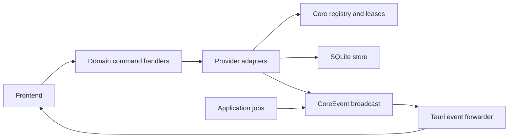

# Core boundaries

Skein hosts its core in process. Packet 38 uses `src-tauri/src/core/` inside
`skein_lib`; it does not add a crate, daemon, plugin ABI or network service.

## Layers

- `lib.rs` hosts setup and composes the handlers exported by `commands/` domains.
  The registration macro derives routing names and Tauri handlers from one list.
  There are 74 default command names, 82 with optional features, and 102 raw
  registrations including platform alternatives. Names, arguments and results
  remain compatible.
- `core/` owns serializable events, typed capability traits and provider lifecycle.
  It has no Tauri imports. Traits use associated types for each capability's
  domain inputs, outputs and errors; asynchronous methods return `ProviderFuture`.
- `github/provider.rs` adapts the existing listing, commit, ref and pull clients.
  The host and source identity come from configuration. Public GitHub and each
  Enterprise source have separate instances and retain their existing HTTP routes,
  credential scopes and errors. Manual sources retain URL listing and Git refs;
  their pull requests use the resolved remote host.
- `providers.rs` is application glue. It supplies the SQLite store, restores
  settings, constructs enabled adapters and passes requests through registry leases.
  Remote refs preserve input order and the existing concurrency bound. URLs shared
  by sources use an enabled matching source when available.
- `store/` owns persistence, serialized writes, cache pruning and recovery.
  Schema migration 2 adds `providers(source_id, enabled)`. An absent row means
  enabled, preserving older settings. Existing listings, refs and commit schemas
  stay in the app crate.

## Capabilities and lifecycle

`RepositoryProvider` offers listing, cached listing, commits and remote refs.
`PullRequestProvider` offers lookup and creation. `CiProvider` offers start and
cancel; `IssueProvider` offers issue lookup. A provider implements its supported
traits. Actions and Jira can implement these contracts and use `Registry
`
without changing `core/`.

The registry keys instances by source ID and normalized host. An unchanged source
keeps its instance. Disabled sources are checked before construction and request
admission. Disabling signals every active lease, drops the registry's instance
and cancels request futures, including HTTP dispatch. Reenabling creates a fresh
instance. Providers currently do foreground work; no polling task is introduced.

SQLite persists enabled flags. Existing Settings load/save commands carry the
optional `Source.enabled` field; Settings supplies one toggle per source.
Unchanged flags require no SQLite write. Disabled listing commands return an empty
list or a cache miss, so startup does not report an unreachable host for a source
the user disabled. Other provider requests report that the source is disabled.

Disabling removes listing, repository, commit and associated ref cache rows in
the flag transaction. A writer-side enabled check rejects late listing writes.
Credential configuration revisions also invalidate requests when enabled state
changes. Settings retain a disabled flag as a recovery fallback; SQLite is
authoritative when its row exists. Tokens remain in the existing keyring service
`paperwing`, and the app identifier remains `dev.paperwing.app`.

## Events

`CoreEvent` is serde serializable and travels through a bounded Tokio broadcast
bus. Its domain contracts are `RepoOpened`, `RepoCloned`, `BranchChanged`,
`PullRequestUpdated`, `CiStarted`, `CiCompleted`, `IssueUpdated` and
`ProviderHealthChanged`. Future integrations can subscribe to the bus or receive
a cloned bus at construction. These domain variants do not add frontend events
automatically.

Compatibility variants retain the previous serialized payloads. The single Tauri
forwarder maps them to `discover-batch`, `discover-done`, `search-matches`,
`search-repo`, `search-done`, `clone-progress`, `clone-finished`, `launch-request`,
`credential-changed`, `git-activity` and optional `diagnostics-progress`.
Bus round-trip and Tauri listener tests cover every name and payload. Forwarding
errors and a lagging receiver are reported. Hosts without a managed bus use the
same forwarding adapter, including existing mock-runtime tests.

## Follow-up: crate extraction

A later packet will extract `skein-core` and add a Cargo workspace. Comparison
currently embeds Linux diff storage and root authority and its tests call native
file modules. First define an application-owned boundary for those values while
preserving Windows cfg blocks and native write guarantees. Packet 38 does not
move compare, git, search, stash, tags, branch cleanup or store modules.
`files.rs`, file guards, commit operations and Linux file modules remain in the
application crate. Windows CI must verify the ten unchanged file-command
registration alternatives now housed in `commands/files.rs`.

An out-of-process worker is a later option for an integration that needs isolation.
A daemon requires cold-start measurements that justify it. Serializable events and
capability-specific contracts preserve these options without adding either now.

## New-integration checklist

Every integration packet must answer the template's ten questions:

1. Which capabilities does it offer?
2. Which credentials and config does it need?
3. Can it be disabled completely (no worker, no polling, no traffic, no cache)?
4. Polling or event-driven?
5. In-process or isolated worker?
6. What persists in SQLite?
7. What is cache only?
8. What happens when it fails or dies?
9. Can another provider replace it?
10. Which events does it produce and consume?
