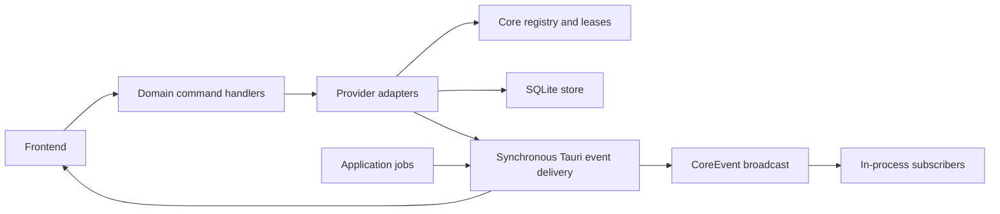

# Core boundaries

Skein hosts its core in process. Packet 38 uses `src-tauri/src/kernel/` inside
`skein_lib`; it does not add a crate, daemon, plugin ABI or network service.

## Layers

- `lib.rs` hosts setup and composes the handlers exported by `commands/` domains.
  The registration macro derives routing names and Tauri handlers from one list.
  There are 84 default command names, 92 with optional features, and 112 raw
  registrations including platform alternatives. Names, arguments and results
  remain compatible.
- `kernel/` owns serializable events, typed capability traits and provider lifecycle.
  It has no Tauri imports. Traits use associated types for each capability's
  domain inputs, outputs and errors; asynchronous methods return `ProviderFuture`.
- `github/provider.rs` adapts the existing listing, commit, ref and pull clients.
  The host and source identity come from configuration. Public GitHub and each
  Enterprise source have separate instances and retain their existing HTTP routes,
  credential scopes and errors. Manual sources retain URL listing and Git refs;
  their pull requests use the resolved remote host.
- `providers.rs` is application glue. It supplies the SQLite cache store,
  constructs enabled adapters and passes requests through registry leases.
  Remote refs preserve input order and the existing concurrency bound. URLs shared
  by sources use an enabled matching source when available.
- `store/` owns cache persistence, serialized writes, cache pruning and recovery.
  Schema migration 3 removes the provider flag table introduced by migration 2.
  Existing listings, refs and commit schemas stay in the app crate.

## Capabilities and lifecycle

`RepositoryProvider` offers listing, cached listing, commits and remote refs.
`PullRequestProvider` offers lookup and creation. `CiProvider` preserves start and
cancel and adds neutral runs, jobs, logs, artifacts, dispatch forms and rerun/cancel
actions with compatible unsupported defaults. `IssueProvider` offers issue lookup. A provider implements its supported
traits. Actions and Jira can implement these contracts and use `Registry
`
without changing `kernel/`.

`kernel/ci.rs` owns CI records and typed errors. `github/actions/` adapts GitHub
Actions and Enterprise JSON through the existing host-aware HTTP client. Its
foreground adapter runs within the configured source's existing registry lease;
admission precedes credentials, HTTP-client construction and every operation.
Targets can be a local checkout or a source ID plus a repository URL registered
in a set or manual source. Remote-only targets require no checkout or Git process.
Every CI record includes its provider and host. Pipeline IDs are opaque; workflow
paths and dispatch events stay inside the GitHub adapter.

CI page commands return an ETag and next page, or a distinct not-modified result.
They add no polling task. Rate limits include their reset time. Write commands
require an explicit confirmation flag. Dispatch loads and validates the pipeline's
inputs at the chosen ref before posting; an accepted dispatch may have no run ID.
Completed-job logs and explicit archive downloads are memory-only and bounded to
64 MiB. Downloads follow at most five HTTPS redirects; credentials only accompany
requests to the configured API origin. No CI logs, artifacts or metadata persist
in SQLite. UI polling, event observation and native acceptance belong to later
Packet 31 steps.

The registry keys instances by source ID and normalized host. An unchanged source
keeps its instance. Disabled sources are checked before construction and request
admission. Disabling signals every active lease, drops the registry's instance
and cancels request futures, including HTTP dispatch. Reenabling creates a fresh
instance. Providers currently do foreground work; no polling task is introduced.

`settings.json` is the single source of truth for `Source.enabled`. Older files
without this field default to enabled. Settings load and startup configuration
never wait for store open or fail because SQLite is unavailable. Existing Settings
load/save commands carry the optional field; Settings supplies one labeled switch
per source. Disabled listing commands return an empty
list or a cache miss, so startup does not report an unreachable host for a source
the user disabled. Other provider requests report that the source is disabled.

Disabling schedules best-effort removal of listing, repository, commit and
associated ref cache rows. A writer-side check of in-memory admission state
derived from settings rejects late listing writes. Reenabling prevents an older
queued cleanup from removing the newly enabled source's cache.
Credential configuration revisions also invalidate requests when enabled state
changes. SQLite never supplies enabled flags. Tokens remain in the existing keyring service
`paperwing`, and the app identifier remains `dev.paperwing.app`.

Disabling the only configured github.com source also refuses `git ls-remote` for
github.com URLs. This is intentional: a disabled host means no traffic, including
Git ref queries. An enabled matching source on that host still admits requests.

## Events

`CoreEvent` is serde serializable. Its domain contracts are `RepoOpened`,
`RepoCloned`, `BranchChanged`,
`PullRequestUpdated`, `CiStarted`, `CiCompleted`, `IssueUpdated` and
`ProviderHealthChanged`. Future integrations can subscribe to the bus or receive
a cloned bus at construction. These domain variants do not add frontend events
automatically.

`events::publish` delivers frontend events synchronously through the existing
Tauri emitter and returns its error to the producer. Search and discovery jobs
cancel on delivery failure. Typed payloads go directly to the emitter, preserving
their original JSON bytes, including `f32` percentages. Compatibility variants
keep raw JSON for in-process subscribers, preserving those bytes during serde
round trips. The single delivery adapter maps them to `discover-batch`, `discover-done`, `search-matches`,
`search-repo`, `search-done`, `clone-progress`, `clone-finished`, `launch-request`,
`credential-changed`, `git-activity` and optional `diagnostics-progress`.
Bus round-trip and Tauri listener tests cover every name and payload. Frontend
delivery is independent of the bounded Tokio broadcast bus. The bus serves only
in-process subscribers, which may lag and must handle `RecvError::Lagged`.
Publishing with no subscribers succeeds. Hosts without a managed bus use the
same synchronous delivery adapter, including existing mock-runtime tests.

## Follow-up: crate extraction

A later packet will extract `skein-core` and add a Cargo workspace. Comparison
currently embeds Linux diff storage and root authority and its tests call native
file modules. First define an application-owned boundary for those values while
preserving Windows cfg blocks and native write guarantees. Packet 38 does not
move compare, git, search, stash, tags, branch cleanup or store modules.
`files.rs`, file guards, commit operations and Linux file modules remain in the
application crate. Windows CI must verify the ten unchanged file-command
registration alternatives now housed in `commands/files.rs`.

An out-of-process worker is a later option for an integration that needs isolation.
A daemon requires cold-start measurements that justify it. Serializable events and
capability-specific contracts preserve these options without adding either now.

## New-integration checklist

Every integration packet must answer the template's ten questions:

1. Which capabilities does it offer?
2. Which credentials and config does it need?
3. Can it be disabled completely (no worker, no polling, no traffic, no cache)?
4. Polling or event-driven?
5. In-process or isolated worker?
6. What persists in SQLite?
7. What is cache only?
8. What happens when it fails or dies?
9. Can another provider replace it?
10. Which events does it produce and consume?
